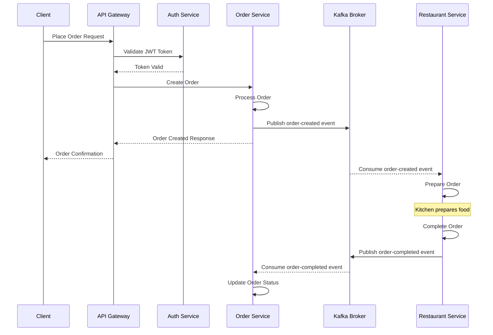
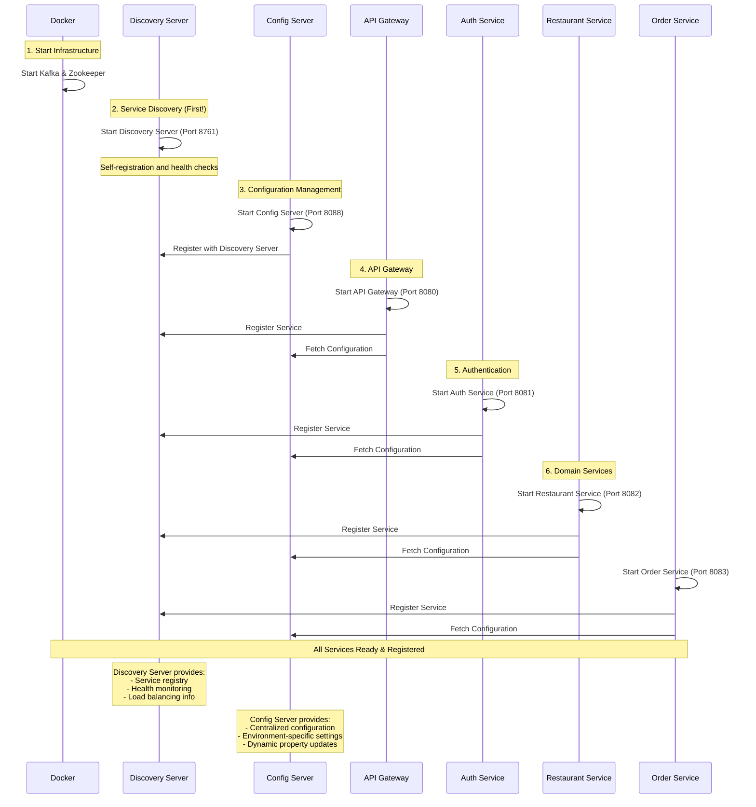

# ByteBiteRestaurants

A microservices application for ByteBites Restaurants

### ABOUT

ByteBite Restaurants is a microservices-based application designed to streamline the process of ordering food from various restaurants. It aims to provide a robust and scalable platform for managing restaurant data, handling food orders, and sending notifications.

The project leverages a modern tech stack centered around **Spring Boot** for building independent microservices, **Apache Kafka** for asynchronous communication and event-driven architecture, and **Docker** for containerization and simplified deployment. Key business features likely include user authentication, browsing restaurants and menus, placing orders, and receiving order updates or confirmations via notifications.

## **📇 Architecture Overview**

```mermaid
graph TB
%% Client Layer
    Client[Client Applications<br/>Web/Mobile/API]

%% API Gateway
    Gateway[API Gateway<br/>Port: 8000<br/>Routing • Security • Load Balancing]

%% Core Business Services
AuthService[Auth Service<br/>Port: 8030<br/>JWT • Authentication<br/>User Management]

RestaurantService[Restaurant Service<br/>Port: 8040<br/>Menu Management<br/>Restaurant Info]

OrderService[Order Service<br/>Port: 8020<br/>Order Creation<br/>Order Status<br/>Payment]

%% Infrastructure Services
ConfigServer[Config Server<br/>Port: 8010<br/>Centralized Configuration]

DiscoveryServer[Discovery Server<br/>Port: 8761<br/>Service Registry<br/>Health Checks]

%% Kafka Infrastructure
KafkaBroker[Kafka Broker<br/>Port: 9092<br/>Message Streaming]

%% Kafka Topics
subgraph KafkaTopics["Kafka Topics"]
OrderCreated[order-created<br/>New Order Events]
OrderCompleted[order-completed<br/>Order Completion Events]
end

%% Database
Database[(MySQL Database<br/>Persistent Storage)]

%% Client to Gateway
Client --> Gateway

%% Gateway to Services (Synchronous REST)
Gateway -.->|REST API| AuthService
Gateway -.->|REST API| RestaurantService
Gateway -.->|REST API| OrderService

%% Service Discovery Connections
Gateway -.->|Service Registration| DiscoveryServer
AuthService -.->|Service Registration| DiscoveryServer
RestaurantService -.->|Service Registration| DiscoveryServer
OrderService -.->|Service Registration| DiscoveryServer

%% Configuration Management
ConfigServer -.->|Configuration| Gateway
ConfigServer -.->|Configuration| AuthService
ConfigServer -.->|Configuration| RestaurantService
ConfigServer -.->|Configuration| OrderService

%% Kafka Connections
KafkaBroker --> KafkaTopics

%% Asynchronous Communication (Kafka Producers)
OrderService -->|Publishes order-created| OrderCreated
RestaurantService -->|Publishes order-completed| OrderCompleted

%% Asynchronous Communication (Kafka Consumers)
OrderCreated -->|Consumes for preparation| RestaurantService
OrderCompleted -->|Consumes for update| OrderService

%% Database Connections
AuthService -.->|JPA| Database
RestaurantService -.->|JPA| Database
OrderService -.->|JPA| Database

%% Styling
classDef serviceBox fill:#e1f5fe,stroke:#0277bd,stroke-width:2px
classDef infrastructureBox fill:#f3e5f5,stroke:#7b1fa2,stroke-width:2px
classDef kafkaBox fill:#fff3e0,stroke:#f57c00,stroke-width:2px
classDef clientBox fill:#e8f5e8,stroke:#388e3c,stroke-width:2px
classDef databaseBox fill:#fce4ec,stroke:#c2185b,stroke-width:2px

class Client clientBox
class Gateway,AuthService,RestaurantService,OrderService serviceBox
class ConfigServer,DiscoveryServer infrastructureBox
class KafkaBroker,KafkaTopics,OrderCreated,OrderCompleted kafkaBox
class Database databaseBox
```



* **`config-server`**: A centralized configuration server that provides configuration to all other microservices, enabling dynamic configuration updates without service restarts.
* **(Eureka)`discovery-server`**: Acts as a service registry where microservices register themselves upon startup and can be discovered by other services. This allows services to find and communicate with each other dynamically.
* **`api-gateway`**: Serves as the single entry point for all client requests. It handles routing requests to the appropriate microservices, performs load balancing, and can implement cross-cutting concerns like authentication and security.
* **`auth-service`**: Manages user authentication and authorization. It handles user registration, login, and token generation/validation to secure access to other services.
* **`restaurant-service`**: Manages all restaurant-related data, including restaurant details, food menus, and pricing.
* **`order-service`**: Responsible for handling the entire order lifecycle, from creating new orders to tracking their status and managing order details.

#### Services primarily communicate in two ways:

* **Synchronous Communication (REST)**: Services like `api-gateway`, `auth-service`, `restaurant-service`, and `order-service` communicate synchronously using RESTful APIs, facilitated by the `discovery-server` for service lookup.
* **Asynchronous Communication (Kafka)**: **Apache Kafka** is used as a message broker for asynchronous, event-driven communication. This is crucial for decoupling services and handling events like order creation, where a single action might trigger multiple subsequent processes.



#### Sequence of Service Startups:



## Service Startup Order & Running the Project

#### Clone Repository

```bash
    git clone https://github.com/Boadu123/ByteBites
```

#### Start Kafka

```bash
    docker compose up -d
```

#### Run Discovery Server(Eureka)

```bash
    cd eureka-service
    mvn clean install -DskipTests
    mvn spring-boot:run
```

#### Run Config Server

```bash
    cd config-server
    mvn clean install -DskipTests
    mvn spring-boot:run
```

#### Run API Gateway

```bash
    cd api-gateway
    mvn clean install -DskipTests
    mvn spring-boot:run
```

#### Run Auth Service

```bash
    cd auth-service
    mvn clean install -DskipTests
    mvn spring-boot:run
```

#### Run Restaurant Service

```bash
    cd restaurant-service
    mvn clean install -DskipTests
    mvn spring-boot:run
```

#### Run Order Service

```bash
    cd order-service
    mvn clean install -DskipTests
    mvn spring-boot:run
```

```
bytebite/
├── 📁 api-gateway/
│   ├── src/
│   ├── pom.xml
│   └── README.md
│
├── 📁 auth-service/
│   ├── src/
│   ├── pom.xml
│   └── README.md
│
├── 📁 config-service/
│   ├── src/
│   ├── pom.xml
│   └── README.md
│
├── 📁 eureka-service/
│   ├── src/
│   ├── pom.xml
│   └── README.md
│
├── 📁 kafka-data/
│   ├── config/
│   └── scripts/
│
├── 📁 order-service/
│   ├── src/
│   ├── pom.xml
│   └── README.md
│
├── 📁 restaurant-service/
│   ├── src/
│   ├── pom.xml
│   └── README.md
│
├── .gitignore
├── docker-compose.yml
├── LICENSE
├── pom.xml
└── README.md
```